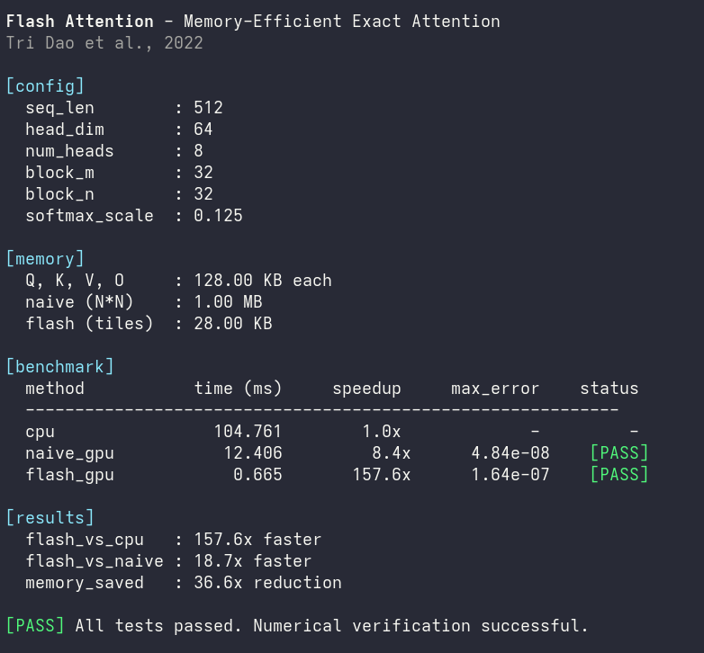

# Flash Attention CUDA Implementation

A minimal CUDA implementation of Flash Attention, demonstrating memory-efficient exact attention computation using tiled matrix operations and online softmax.

## Overview

Standard attention requires O(N^2) memory to store the attention matrix, which becomes prohibitive for long sequences. Flash Attention computes exact attention in O(N) memory by:

1. Processing Q, K, V in tiles that fit in SRAM (shared memory)
2. Using online softmax to avoid materializing the full attention matrix
3. Accumulating results incrementally with numerical stability corrections

This implementation is based on the paper "FlashAttention: Fast and Memory-Efficient Exact Attention with IO-Awareness" by Tri Dao et al., 2022.

## Algorithm

```
For each query block Q[i:i+Bm]:
    Initialize: O = 0, l = 0, m = -inf
    For each key/value block K[j:j+Bn], V[j:j+Bn]:
        1. Load Q, K, V tiles into shared memory
        2. Compute S = Q @ K^T * scale
        3. Update running max: m_new = max(m, rowmax(S))
        4. Compute P = exp(S - m_new)
        5. Update sum: l_new = exp(m - m_new) * l + rowsum(P)
        6. Update output: O = exp(m - m_new) * O + P @ V
        7. m = m_new, l = l_new
    Final: O = O / l
```

The key insight is maintaining running statistics (max and sum) that allow incremental softmax computation without seeing all values upfront.

## Implementation Details

| Parameter | Default Value | Description |
|-----------|---------------|-------------|
| SEQ_LEN | 512 | Sequence length (N) |
| HEAD_DIM | 64 | Head dimension (d) |
| BLOCK_M | 32 | Tile size for queries |
| BLOCK_N | 32 | Tile size for keys/values |
| SOFTMAX_SCALE | 1/sqrt(64) | Attention scaling factor |

**Memory Layout:**
- Q, K, V, O: [N, d] in row-major order
- Shared memory per block: ~28 KB (Q tile + K tile + V tile + S tile)

**Development Environment:**
- GPU: NVIDIA GeForce RTX 3050 Laptop GPU (Ampere, SM86)
- CUDA: 13.0
- OS: Fedora Linux

## Build

```bash
nvcc -std=c++17 -arch=sm_XX flash_attention.cu -o flash_attention
```

Replace `sm_XX` with your GPU's compute capability:
- RTX 4090/4080/4070: `sm_89`
- RTX 3090/3080/3070/3060/3050: `sm_86`
- RTX 2080/2070/2060: `sm_75`
- GTX 1080/1070/1060: `sm_61`

To find your compute capability:
```bash
nvidia-smi --query-gpu=compute_cap --format=csv
```

## Usage

```bash
./flash_attention
```

The program runs three implementations and compares results:
1. **CPU reference** - Standard attention for correctness verification
2. **Naive GPU** - Materializes full N x N attention matrix
3. **Flash GPU** - Tiled computation with online softmax

## Sample Output



## Performance

Results on RTX 3050 Laptop GPU (N=512, d=64):

| Method | Time (ms) | Speedup vs CPU | Memory |
|--------|-----------|----------------|--------|
| CPU | 109.5 | 1.0x | N/A |
| Naive GPU | 12.4 | 8.8x | 1.00 MB (N^2) |
| Flash GPU | 0.67 | 164x | 28 KB (tiles) |

Memory reduction: 36.6x compared to naive implementation.

## Configuration

Modify the constants in `flash_attention.cu` to experiment with different configurations:

```cpp
constexpr int SEQ_LEN   = 512;    // Sequence length (N)
constexpr int HEAD_DIM  = 64;     // Head dimension (d)
constexpr int BLOCK_M   = 32;     // Tile size for queries
constexpr int BLOCK_N   = 32;     // Tile size for keys/values
```

Tile sizes should be tuned based on your GPU's shared memory capacity (48 KB for most modern GPUs).

## Limitations

- **Single head only**: Does not batch across multiple attention heads
- **Forward pass only**: Backward pass / gradient computation not implemented
- **FP32 only**: No FP16 or Tensor Core optimized path
- **No causal masking**: Implements full (bidirectional) attention only
- **Educational implementation**: For production use, see the official [FlashAttention](https://github.com/Dao-AILab/flash-attention) library

## Acknowledgments

Output formatting and boilerplate code generated with assistance from Claude (Anthropic).

## References

```bibtex
@inproceedings{dao2022flashattention,
  title={FlashAttention: Fast and Memory-Efficient Exact Attention with IO-Awareness},
  author={Dao, Tri and Fu, Dan and Ermon, Stefano and Rudra, Atri and R{\'e}, Christopher},
  booktitle={Advances in Neural Information Processing Systems},
  year={2022}
}
```

## License

MIT License

